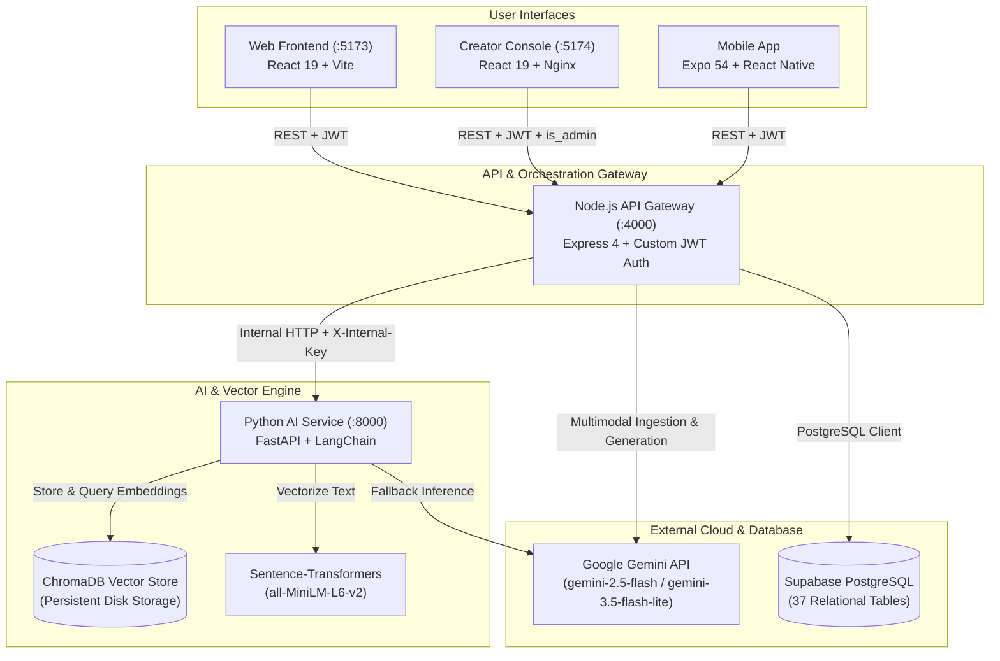

# 🦊 SourceWise — AI-Powered Active Recall Study Suite

[](https://sourcewise-app.vercel.app)
[](https://node-api-nine-flame.vercel.app/health)
[](https://react.dev/)
[](https://nodejs.org/)
[](https://fastapi.tiangolo.com/)
[](https://deepmind.google/technologies/gemini/)

---

## 💡 Project overview

**SourceWise** is an intelligent, multimodal AI-powered study ecosystem engineered to convert raw study materials—lecture slides, textbooks, orientation speeches, research documents, and codebases—into high-retention, active-learning experiences.

Rather than relying on passive reading or highlighting notes, SourceWise grounds all learning tools in cognitive science principles: **Active Recall**, **Spaced Repetition (FSRS-v5)**, and **Socratic Inquiry**.

```
┌──────────────────────────────────────────────────────────────────────────┐
│                             SOURCEWISE SUITE                             │
│                                                                          │
│   📚 Multimodal Ingestion ──► 🧠 Semantic Knowledge Graph ──► 🎯 Mastery │
│   (PDF, DOCX, TXT, Code)      (ChromaDB + Gemini 3.5)        (FSRS Spaced│
│                                                               Repetition)│
└──────────────────────────────────────────────────────────────────────────┘
```

### ✨ Core Capabilities

- **Multimodal Document Understanding**: Ingests multi-page PDFs natively using Google Gemini multimodal `inlineData` extraction. Extracts exact text, architectural concepts, definitions, formulas, and takeaways directly from raw document bytes—preventing hallucinations.
- **AI Workspace**: An interactive multi-tool study terminal with streaming RAG responses, inline citation badges, and one-click quick document uploads and replacements.
- **Active Recall Flashcards**: Spaced-repetition card decks generated directly from document text with 3D interactive flip animations, rating feedback (*Again*, *Hard*, *Good*, *Easy*), and customizable deck sizes (5, 10, 15, 20 cards).
- **Auto-Graded Practice Quizzes**: Customizable quizzes with 4 options, automated scoring, instant answer feedback, and step-by-step conceptual explanations derived from the source.
- **Socratic & Mentor Tutoring**: Interactive 1-on-1 tutoring sessions tailored to student preference (*Friendly Companion*, *Direct Tutor*, or *Socratic Mentor*) that guide learners to deduce answers themselves.
- **Knowledge Hub & Interactive Graph**: Visual knowledge graph mapping relationships between concepts across multiple documents with cross-source synthesis.
- **Multi-Subject Study Planner (v13)**: Exam date pacing algorithms, Google Calendar blocker synchronization, automated hourly replanning, and day-by-day study calendars.
- **Puzzle Arena**: Gamified active recall challenges including Word Search, Concept Match, Rapid Fire, Memory Flip, Anagrams, and Cloze deletion tests.
- **DeepCode AI Inspector**: Live multi-language code runner with AST compiler diagnostics and algorithm mentor.
- **Creator Console**: Standalone administrator dashboard for tracking token consumption, model latencies, user credit economies, and system uptime.
- **Cross-Platform Mobile Client**: Mobile companion application built with React Native and Expo for studying on the go.

### 🏛️ System Architecture



---

## 🛠️ Technologies used

### 💻 Web Client (`sourcewise-frontend`)
- **Framework**: [React 19](https://react.dev/) with [Vite 8](https://vitejs.dev/)
- **Styling**: [TailwindCSS 3](https://tailwindcss.com/) with custom educational design tokens
- **Animations**: [Framer Motion](https://www.framer.com/motion/) & [Canvas-Confetti](https://www.npmjs.com/package/canvas-confetti)
- **State Management**: [Zustand 5](https://github.com/pmndrs/zustand)
- **Routing**: [React Router 7](https://reactrouter.com/)
- **Icons**: [Lucide React](https://lucide.dev/)
- **Charts & Visualizations**: [Recharts 2](https://recharts.org/)

### 📊 Creator Dashboard (`sourcewise-dashboard`)
- **Framework**: [React 19](https://react.dev/) + [Vite 8](https://vitejs.dev/)
- **Styling & Components**: TailwindCSS 3 & customized admin data tables
- **Testing**: [Vitest 2](https://vitest.dev/)
- **Containerization**: Multi-stage Docker build served via Alpine Nginx

### 📱 Mobile Client (`sourcewise-mobile`)
- **Framework**: [Expo 54](https://expo.dev/) with [React Native 0.81](https://reactnative.dev/)
- **Routing**: [Expo Router 6](https://docs.expo.dev/router/introduction/)
- **State & Data Fetching**: Zustand 5 & React Query 5

### ⚙️ Backend API Gateway (`sourcewise-backend/node-api`)
- **Runtime**: [Node.js 20 LTS](https://nodejs.org/)
- **Server Framework**: [Express 4](https://expressjs.com/)
- **Security & Headers**: [Helmet](https://helmetjs.github.io/), CORS, and rate limiting
- **Authentication**: Custom bcrypt hashing with JSON Web Tokens (7-day expiry)
- **Token Economy & Budgeting**: Per-tier token reservation and metering middleware
- **Data Encryption**: AES-256-GCM encryption for integration tokens

### 🤖 AI Service & Vector Engine (`sourcewise-backend/python-ai`)
- **Framework**: [FastAPI 0.109](https://fastapi.tiangolo.com/) + [Uvicorn](https://www.uvicorn.org/)
- **Embeddings**: `sentence-transformers` (`all-MiniLM-L6-v2`)
- **Vector Database**: [ChromaDB](https://www.trychroma.com/) (persisted to disk volume)
- **Document Extractors**: Native Gemini multimodal parsing, `pdfplumber`, `python-docx`
- **Cloud LLM Providers**: Google Gemini (`gemini-2.5-flash`, `gemini-3.5-flash-lite`), Grok fallback

### 🗄️ Database & Storage
- **Database**: [Supabase PostgreSQL](https://supabase.com/) (37 relational tables)
- **Security**: Row-Level Security (RLS) policies with service-role API gateway mediation

---

## ⚙️ Setup & installation steps

### 📋 Prerequisites
Ensure the following tools are installed on your machine:
- **Node.js**: `v20.x` or higher ([Download](https://nodejs.org/))
- **npm**: `v10.x` or higher
- **Python**: `v3.11.x` ([Download](https://www.python.org/))
- **Git**: Installed and configured
- **Docker & Docker Compose**: Optional (recommended for containerized execution)
- **API Keys**:
  - Google Gemini API Key ([Get here](https://aistudio.google.com/))
  - Supabase Project URL & Service Role Key ([Get here](https://supabase.com/))

---

### Step 1: Clone the Repository

```bash
git clone https://github.com/Deepan9884/Sourcewise-Build-With-AI-.git
cd Sourcewise-Build-With-AI-
```

---

### Step 2: Configure Environment Variables

Create the `.env` configuration files in their respective directories.

#### 1. Backend Node API (`sourcewise-backend/node-api/.env`):
```env
PORT=4000
NODE_ENV=development
FRONTEND_ORIGIN=http://localhost:5173,http://localhost:5174

# Database (Supabase)
SUPABASE_URL=https://your-project.supabase.co
SUPABASE_ANON_KEY=your-supabase-anon-key
SUPABASE_SERVICE_ROLE_KEY=your-supabase-service-role-key

# Authentication & Security
JWT_SECRET=your-secure-jwt-secret-string-min-32-chars
ENCRYPTION_KEY=your-32-byte-base64-encryption-key

# AI Integration
GEMINI_API_KEY=your-google-gemini-api-key
PYTHON_AI_URL=http://localhost:8000
INTERNAL_API_KEY=your-internal-service-shared-secret
```

#### 2. Python AI Service (`sourcewise-backend/python-ai/.env`):
```env
PORT=8000
INTERNAL_API_KEY=your-internal-service-shared-secret
GEMINI_API_KEY=your-google-gemini-api-key
LLM_PROVIDER=gemini
GEMINI_MODEL=gemini-2.5-flash
CHROMA_PERSIST_DIR=./chroma_db
EMBEDDING_MODEL=all-MiniLM-L6-v2
```

#### 3. Web Frontend (`sourcewise-frontend/.env`):
```env
VITE_API_URL=http://localhost:4000
VITE_AI_URL=http://localhost:8000
```

#### 4. Creator Dashboard (`sourcewise-dashboard/.env`):
```env
VITE_API_URL=http://localhost:4000
```

---

### Step 3: Run Database Migrations

Open your **Supabase Project Dashboard** $\rightarrow$ **SQL Editor**, and run the migration scripts located in `sourcewise-backend/node-api/`:
1. `v2_schema.sql` (source analysis & knowledge mastery tables)
2. `v5_lirs_schema.sql` (reinforcement events & learning outcomes)
3. `token_tracking_schema.sql` (token ledgers, user credits & provider pricing)
4. `v13_study_organizer_schema.sql` (mood checkins, calendar sync & multi-subject study plans)
5. `fix_rls.sql` (security & row-level access configuration)

---

### Step 4: Install Dependencies

#### Monorepo Root:
```bash
npm install
```

#### Backend Services (One-Command Setup):
```bash
cd sourcewise-backend
npm run setup
cd ..
```
*This installs Node dependencies in `node-api/` and installs pip packages from `python-ai/requirements.txt`.*

#### Web Frontend:
```bash
cd sourcewise-frontend
npm install
cd ..
```

#### Creator Dashboard:
```bash
cd sourcewise-dashboard
npm install
cd ..
```

---

## 🚀 How to run the project

### 💻 Option A: Run Services Locally (Recommended for Development)

Run each service in separate terminal windows:

#### 1. Start the Backend Services (Node API + Python AI):
```bash
cd sourcewise-backend
npm run dev
```
> Spawns both the Node API (`http://localhost:4000`) and the Python AI Service (`http://localhost:8000`) with prefixed logs and startup health gating.

#### 2. Start the Web Frontend:
```bash
cd sourcewise-frontend
npm run dev
```
> Launches the React 19 application at **`http://localhost:5173`**.

#### 3. Start the Creator Dashboard (Admin Console):
```bash
cd sourcewise-dashboard
npm run dev
```
> Launches the Creator Console at **`http://localhost:5174`** *(requires an account with `is_admin = true`)*.

---

### 🐳 Option B: Run with Docker Compose

To orchestrate the backend services and Creator Dashboard in Docker containers:

```bash
docker-compose up --build
```

- **Node API**: `http://localhost:4000`
- **Python AI Service**: `http://localhost:8000`
- **Creator Dashboard**: `http://localhost:5174`
- **Persistent Volume**: ChromaDB vector store mapped to `chroma_data`

---

### 📱 Option C: Run the Mobile Application

To run the mobile client on iOS/Android simulators or physical devices:

```bash
cd sourcewise-mobile
npm install
npx expo start
```
*Scan the generated QR code with the Expo Go app (Android) or Camera app (iOS).*

---

### 🧪 Option D: Running Tests & Verification

#### Verify Service Health Endpoints:
```bash
# Node API Health
curl http://localhost:4000/health

# Python AI Health
curl http://localhost:8000/health

# Readiness check (LLM, Embedder, Chroma)
curl http://localhost:8000/metrics/ready
```

#### Run Test Suites:
```bash
# Backend Node API Tests
cd sourcewise-backend/node-api
npm test

# Creator Dashboard Tests
cd sourcewise-dashboard
npm test -- --run

# Python AI Service Tests
cd sourcewise-backend/python-ai
pytest
```

---

### 🌐 Live Production Deployments

| Component | Production URL | Status |
|---|---|---|
| **Web Application** | [https://sourcewise-app.vercel.app](https://sourcewise-app.vercel.app) |  |
| **Node API Gateway** | [https://node-api-nine-flame.vercel.app](https://node-api-nine-flame.vercel.app/health) |  |

---

## 📄 License

This project is licensed under the MIT License.
